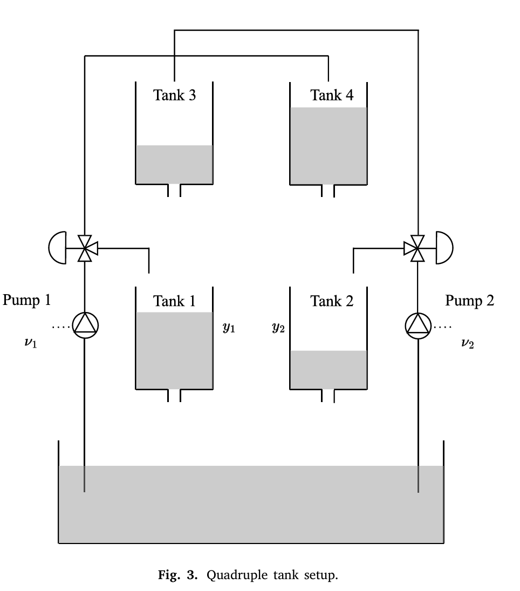

# Process Control using RL agents

## Modelo da Planta Utilizada para o Treinamento
- Tanques - Representa uma planta com 4 tanques de acordo com a imagem a seguir

Essa planta segue essa modelagem:
$$
\begin{aligned}
\frac{dh_{1}}{dt} &= -\frac{a_{1}}{A_{1}}\sqrt{2gh_{1}} + \frac{a_{3}}{A_{1}}\sqrt{2gh_{3}} + \frac{\gamma_{1}k_{1}}{A_{1}}v_{1} \\
\frac{dh_{2}}{dt} &= -\frac{a_{2}}{A_{2}}\sqrt{2gh_{2}} + \frac{a_{4}}{A_{2}}\sqrt{2gh_{4}} + \frac{\gamma_{2}k_{2}}{A_{2}}v_{2} \\
\frac{dh_{3}}{dt} &= -\frac{a_{3}}{A_{3}}\sqrt{2gh_{3}} + \frac{(1-\gamma_{2})k_{2}}{A_{3}}v_{2} \\
\frac{dh_{4}}{dt} &= -\frac{a_{4}}{A_{4}}\sqrt{2gh_{4}} + \frac{(1-\gamma_{1})k_{1}}{A_{4}}v_{1}
\end{aligned}
$$

Com os seguintes dados:
### Parâmetros do Sistema

| Parâmetro | Símbolo | Valor | Unidade |
| :--- | :---: | :---: | :---: |
| Área da seção reta (Tanques 1 e 3) | $A_1, A_3$ | 28 | $\text{cm}^2$ |
| Área da seção reta (Tanques 2 e 4) | $A_2, A_4$ | 32 | $\text{cm}^2$ |
| Área do orifício de saída (Tanques 1 e 3) | $a_1, a_3$ | 0.071 | $\text{cm}^2$ |
| Área do orifício de saída (Tanques 2 e 4) | $a_2, a_4$ | 0.051 | $\text{cm}^2$ |

#### Configurações de Operação

| Parâmetro | Fase Mínima (M) | Fase Não-Mínima (N-M) | Unidade |
| :--- | :---: | :---: | :---: |
| Constantes das Bombas $(k_1, k_2)$ | (3.33, 3.35) | (3.24, 3.29) | $\text{cm}^3/\text{Vs}$ |
| Razão das Válvulas $(\gamma_1, \gamma_2)$ | (0.70, 0.60) | (0.43, 0.34) | - |

## Algoritmo do Agente RL

O objetivo é substituir o controle PID tradicional por dois agentes RL para fazer o controle das alturas h1 e h2. Os agentes foram treinados usando o algoritmo Multi Agent Deep Deterministic Policy Gradient (MADDPG)
